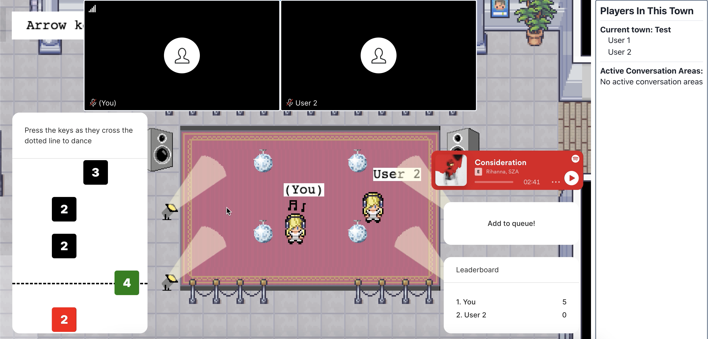
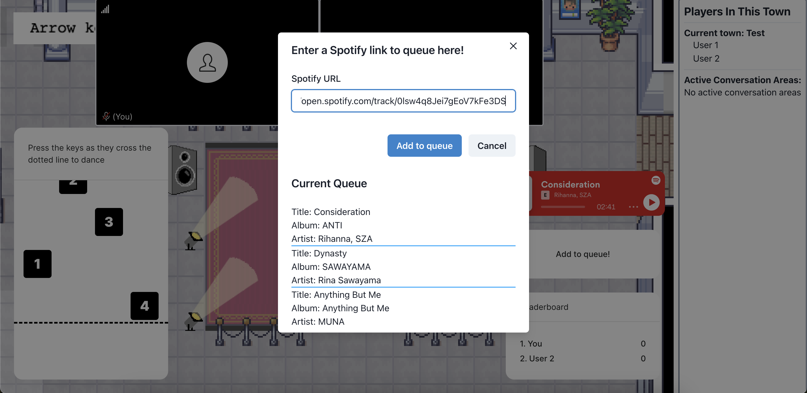
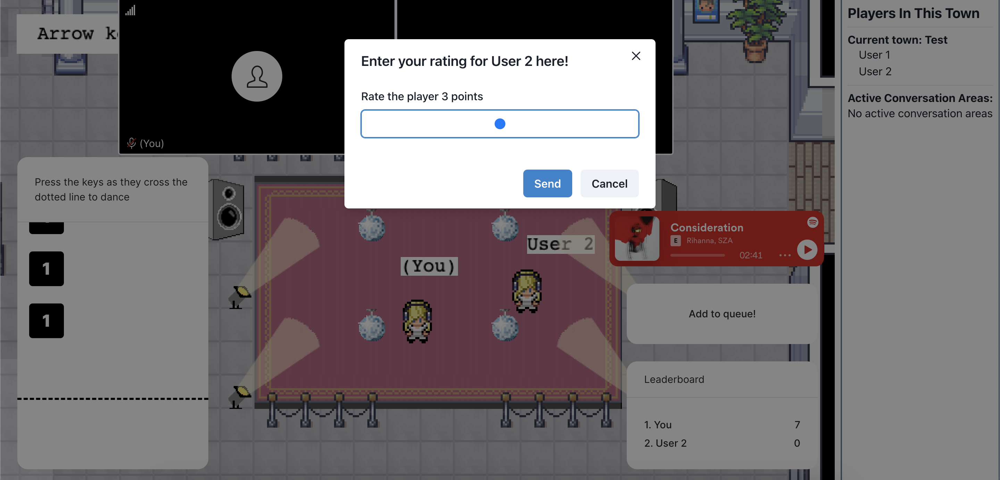

# Covey.Town Dance Area

Covey.Town is a full-stack web application that provides a virtual meeting space where different groups of people can have simultaneous video calls, allowing participants to drift between different conversations, just like in real life. This fork of the original open-source application adds a new virtual dancing game to the application.

This project was created as a part of Northeastern University's software engineering course. You can view the reference deployment of the original application at [app.covey.town](https://app.covey.town/), and the original source code at [github.com/neu-se/covey.town](https://github.com/neu-se/covey.town).

## New Features
The Covey.Town map contains a variety of "interactable areas" that allow users to watch videos, have discussions, and view posters. This project adds a new dance floor interactable area to the map, allowing users to listen to music from a shared queue, compete in a dancing game, and rate other player's dance moves.

The screenshot above shows the main layout of the dance area user interface. The panel on the left side of the screen displays the dancing game. By pressing each key as it scrolls past the dotted line, users can make their avatar perform a dancing animation. Dancing animations are visible for any player in the area. Each successful dance move adds points to your score, and each players' point total is displayed on a leaderboard in the bottom right panel.

Clicking the "Add the queue" button opens a modal that allows users to enter links to spotify songs. When a link is entered, the backend makes a request to the Spotify web API to obtain information about the track like the title, album, artist, and duration. This information is displayed in the queue at the bottom of the modal. Once the duration of the song passes, the currently playing songs switches for everyone in the area. Users can play the current song using the embedded spotify player on the right side of the screen.

Clicking on a users's name on the leaderboard opens a modal allowing users to rate other players in the area. When a player is rated, points are added to their total and they are notified that another player like their dancing.

## Architecture Overview

The figure above depicts the high-level architecture of Covey.Town.
The frontend client (in the `frontend` directory of this repository) uses the [PhaserJS Game Library](https://phaser.io) to create a 2D game interface, using tilemaps and sprites. The other parts of the user interface are implemented with React.
The frontend implements video chat using the [Twilio Programmable Video](https://www.twilio.com/docs/video) API, and that aspect of the interface relies heavily on [Twilio's React Starter App](https://github.com/twilio/twilio-video-app-react). Twilio's React Starter App is packaged and reused under the Apache License, 2.0.

A backend service (in the `townService` directory) implements the application logic: tracking which "towns" are available to be joined, and the state of each of those towns. To support the new dance area features, the backend use's the [Spotify's Web API](https://developer.spotify.com/documentation/web-api) to get information on tracks.

For more information of the application architecture, see [the architecture documentation](./docs/architecture.md).

## Running this app locally

Running the application locally entails running both the backend service and a frontend.

### Setting up the backend

To run the backend, you will need a Twilio account. Twilio provides new accounts with $15 of credit, which is more than enough to get started.
To create an account and configure your local environment:

1. Go to [Twilio](https://www.twilio.com/) and create an account. You do not need to provide a credit card to create a trial account.
2. Create an API key and secret (select "API Keys" on the left under "Settings")
3. Create a `.env` file in the `townService` directory, setting the values as follows:

| Config Value            | Description                               |
| ----------------------- | ----------------------------------------- |
| `TWILIO_ACCOUNT_SID`    | Visible on your twilio account dashboard. |
| `TWILIO_API_KEY_SID`    | The SID of the new API key you created.   |
| `TWILIO_API_KEY_SECRET` | The secret for the API key you created.   |
| `TWILIO_API_AUTH_TOKEN` | Visible on your twilio account dashboard. |

You will also need a spotify developers account for the music queue in the dance areas to work correctly.

1. Go to [Spotify](https://developer.spotify.com) and create a spotify account.
2. On the developer dashboard, create a new app.
3. Add the following values to the same `.env` file in the `townService` directory.

| Config Value            | Description                                 |
| ----------------------- | ------------------------------------------- |
| `SPOTIFY_CLIENT_ID`     | Visible in the settings tab of the new app. |
| `SPOTIFY_CLIENT_SECRET` | Visible in the settings tab of the new app. |

### Starting the backend

Once your backend is configured, you can start it by running `npm start` in the `townService` directory (the first time you run it, you will also need to run `npm install`).
The backend will automatically restart if you change any of the files in the `townService/src` directory.

### Configuring the frontend

Create a `.env` file in the `frontend` directory, with the line: `REACT_APP_TOWNS_SERVICE_URL=http://localhost:8081` (if you deploy the towns service to another location, put that location here instead)

### Running the frontend

In the `frontend` directory, run `npm start` (again, you'll need to run `npm install` the very first time). After several moments (or minutes, depending on the speed of your machine), a browser will open with the frontend running locally.
The frontend will automatically re-compile and reload in your browser if you change any files in the `frontend/src` directory.

Sign into your spotify account in the browser where you are running Covey.Town at [open.spotify.com](https://open.spotify.com/). This will enable the full functionality of the embedded music player in the dance area.

